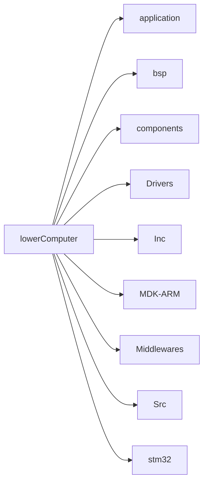

# RobotMaster 2023 赛季哨兵电控开源

## 简介

该工程为RobotMaster2023赛季电控开源，本工程从第一版代码迭代至今，实现了众多功能，并在RobotMaster 2023赛季取得了一个令我满意的成果。

## 开发环境

本工程在windwos环境下使用keil开发，用Visual Studio Code进行代码编辑。

## 硬件条件

### 开发板

本工程使用DJI RobotMaster 开发板C进行开发。

## 文件结构说明

工程目录为[lowerComputer](lowerComputer)。其目录结构入下

